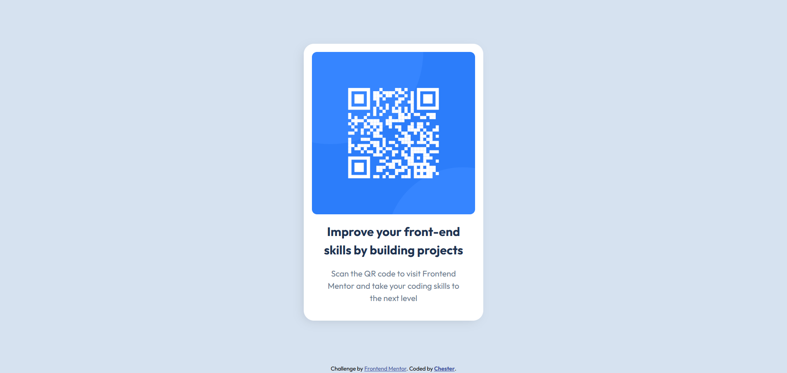

# Frontend Mentor - QR code component solution

This is a solution to the [QR code component challenge on Frontend Mentor](https://www.frontendmentor.io/challenges/qr-code-component-iux_sIO_H). Frontend Mentor challenges help you improve your coding skills by building realistic projects. 

## Table of contents

- [Overview](#overview)
  - [Screenshot](#screenshot)
  - [Links](#links)
- [My process](#my-process)
  - [Built with](#built-with)
  - [What I learned](#what-i-learned)
  - [Continued development](#continued-development)
  - [Useful resources](#useful-resources)
- [Author](#author)
- [Acknowledgments](#acknowledgments)

## Overview

### Screenshot




### Links

- Solution URL: [Add solution URL here](https://www.frontendmentor.io/solutions/responsive-qr-code-component-with-hover-shadow-animation-WeYC1cXVdW)
- Live Site URL: [Add live site URL here](https://qrcode-component-beta.vercel.app/)

## My process

### Built with

- Semantic HTML5 markup
- CSS custom properties
- CSS Grid (to center the card with place-items: center)
- Flexbox (to align items inside the card)
- Mobile-first workflow
- Box-shadow hover animation

### What I learned

How to perfectly center a single element using CSS Grid and place-items: center.
Improved my understanding of semantic HTML structure.

```css
.qr-card {
  box-shadow: -5px 5px 20px -5px rgba(0, 0, 0, 0.129);
  transition: box-shadow 0.35s ease;
}
.qr-card:hover {
  box-shadow: -10px 10px 25px -5px rgba(0, 0, 0, 0.22); 
}
```

### Continued development
In future projects, I want to continue improving my CSS layout skills, exploring more responsive design techniques, and practicing clean component-based structuring.

## Author
- Frontend Mentor - [@Chester1103](https://www.frontendmentor.io/profile/Chester1103)
- Github - [@Chester1103](https://github.com/Chester1103)

## Acknowledgments